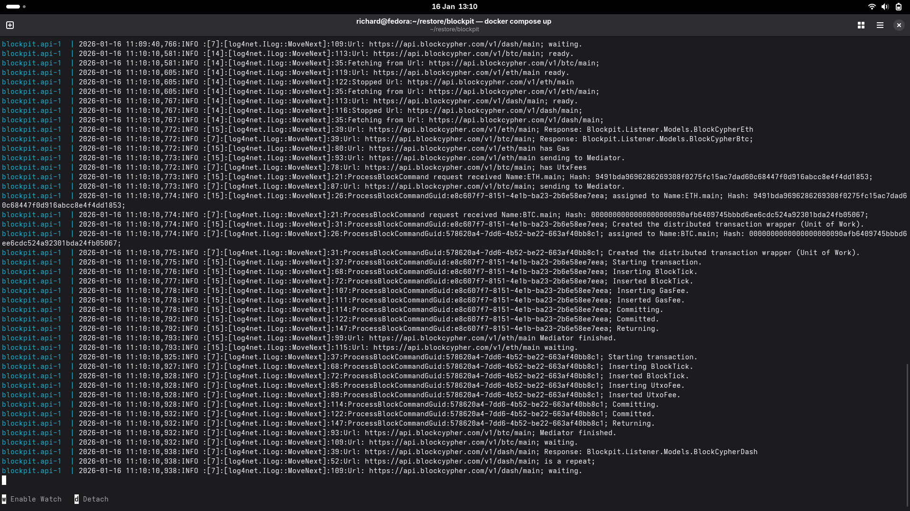
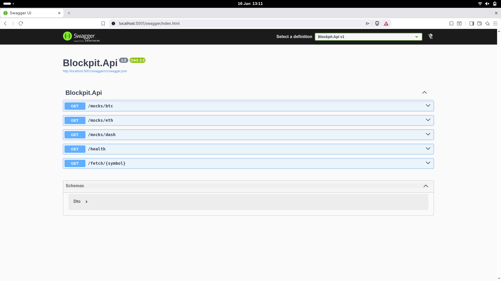
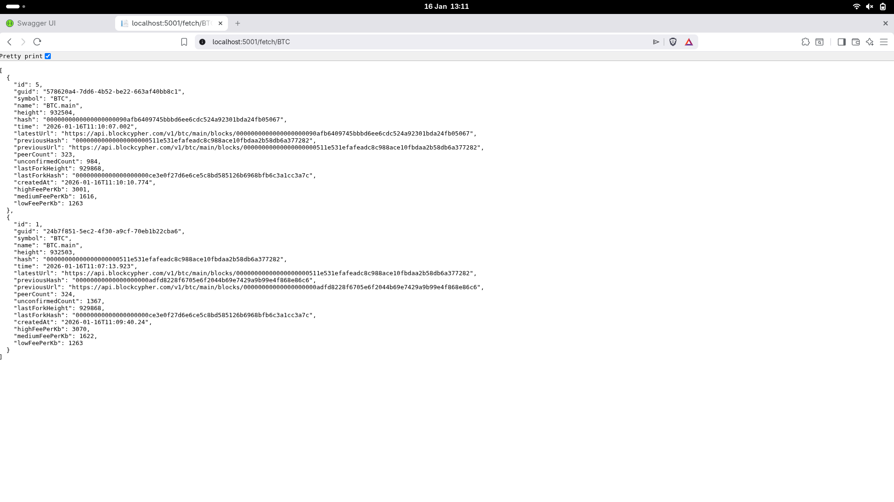

# Welcome

Welcome to Blockpit. Blockpit is an application that polls the following Block.io resources:

* https://api.blockcypher.com/v1/eth/main
* https://api.blockcypher.com/v1/dash/main
* https://api.blockcypher.com/v1/btc/main

The payloads are transposed to a local SQLLite database, and made available on an indexed basis, rendering output from
service endpoints (e.g. http://localhost:5001/fetch/BTC).

Port binding is all interfaces on port 5001. Only http is supported.

# Quick Start

It is recomended to run Blockpit via Docker. The following steps need be followed to instantiate the application:

````shell
git clone https://github.com/richard-churchman/blockpit
cd blockpit
docker compose up
````

The -d detatch switch has been deliberetely ommitted to expose logging. To update to latest versions of Blockpit,
assuming in Blockpit directory:

````shell
git pull
docker compose up --build
````

The docker compose file won't find published remote images, and henceforth will build to dockerfile.

Upon build, logging will be written out indicating that Blockpit has both started, and is processing.



# Configuration Settings

Given container first approach, all configuration is passed to the application via Environment Variables as follows:

| Environment Variable          | Default                                                            | Description                                                             |
|-------------------------------|--------------------------------------------------------------------|-------------------------------------------------------------------------|
| CONNECTION_STRING             | Data Source=blockpit.db                                            | The file location of the sqllite database.                              |
| BLOCK_CYPHER_BTC_URL          | https://api.blockcypher.com/v1/btc/main                            | The endpoint for BTC data.                                              |
| BLOCK_CYPHER_DASH_URL         | https://api.blockcypher.com/v1/dash/main                           | The endpoint for DASH data.                                             |
| BLOCK_CYPHER_ETH_URL          | https://api.blockcypher.com/v1/eth/main                            | The endpoint for ETH data.                                              |
| CORS_ORIGIN                   | *                                                                  | The CORS Origin configuration string (i.e. allowed hosts).              |
| FETCH_LIMIT                   | 100                                                                | The maximum number of records returned from the Fetch endpoint.         |
| FETCH_DATE_OFFSET_DAYS        | 7                                                                  | The CreatedAt days from range for the Fetch endpoint.                   | 
| LOG4NET_LOG_LEVEL             | INFO                                                               | Programatic instantiation of log4net configuration, as below.           |  
| LOG4NET_PATTERN_LAYOUT        | %date:%-5level:[%thread]:[%logger::%method]:%line:%message%newline | Programatic instantiation of log4net configuration, as below.           | 
| LOG4NET_MAXIMUM_FILE_SIZE     | 100MB                                                              | Programatic instantiation of log4net configuration, as below.           |
| LOG4NET_MAX_SIZE_ROLL_BACKUPS | 1000                                                               | Programatic instantiation of log4net configuration, as below.           |
| LOG4NET_LOG_PATH              | null                                                               | Programatic instantiation of log4net configuration, as below.           |
| IGNORE_SSL                    | false                                                              | Ignore SSL on HTTP tests,  usful for polling mocks.                     |
| POLL_RATE                     | 30000                                                              | The wait interval to poll endpoints,  infrequently to avoid rate limit. |

# Programatic Instantiation of Log4net

Blockpit makes the assumption that the log4net file can't be configured in the container, and is instead instantiated
programatically using
environment variables, whereby the ConsoleAppender and RollingFileAppender options are exposed.

The recomendation when running under Docker is to use stdout interfaces in any case,
and relay on Docker for wider log integration, and as such, only log patterns and levels need attention in practice.

# Swagger

Blockpit exposes a Swagger interface at http://localhost:5001/swagger



# Fetch Endpoint

An endpoint to fetch polled data is available at http://localhost:5001/fetch/{symbol}, where the token {symbol} is:

* BTC (http://localhost:5001/fetch/BTC)
* ETH (http://localhost:5001/fetch/eth)
* DASH (http://localhost:5001/fetch/dash)



# Idempotency

Blockchain data is not especially volatile as compared to stock price data, and given a poll based integration
methodology, it is highly likely to process repeats. Idemptency on blockchain data is maintained given a composite key
comprising the following:

* Hash.
* Height.
* LastHash.

In the case that the composite key exists in either the listner session or database, it will be ignored as a repeat.

# Health

Observability is handled by time to live counters aggregated in a service instance available to the whole application.

A health endpoint is exposed that shows the counters, giving insight into internal behavours of the high throughput
system:

http://localhost:5001/health

The following counters provide for observability:

| Counter                             | Description                                                         |
|-------------------------------------|---------------------------------------------------------------------|
| BTCPollRepeat                       | Record identified as duplicate in BTC poll cache.                   |
| BTCPollRepeatMediator               | Record identified as duplicate in mediator for BTC listner.         |
| BTCPoll                             | Sucessful BTC poll and mediation.                                   |
| BTCPollErrors                       | Unhandled error in BTC listener poll.                               |
| DASHPollRepeat                      | Record identified as duplicate in DASH poll cache.                  |
| DASHPollRepeatMediator              | Record identified as duplicate in mediator for DASH listner.        |
| DASHPoll                            | Sucessful DASH poll and mediation.                                  |
| DASHPollErrors                      | Unhandled error in DASH listener poll.                              |
| ETHPollRepeat                       | Record identified as duplicate in ETH poll cache.                   |
| ETHPollRepeatMediator               | Record identified as duplicate in mediator for ETH listner.         |
| ETHPoll                             | Sucessful ETH poll and mediation.                                   |
| ETHPollErrors                       | Unhandled error in ETH listener poll.                               |
| BlockTickHandler                    | Invocation of mdeiator handler.                                     |
| BlockTickHandlerRollbackIdempotency | Rollback for repeat in mediator handler.                            |
| BlockTickHandlerCommit              | Sucessful commit in mediator handler.                               |
| BlockTickHandlerRollbackFatal       | Fatal and unhandled error in mediator handler (caught in listener). |

Counters maintained over a rolling five minute window, with expired counters removed at thirty second intervals.